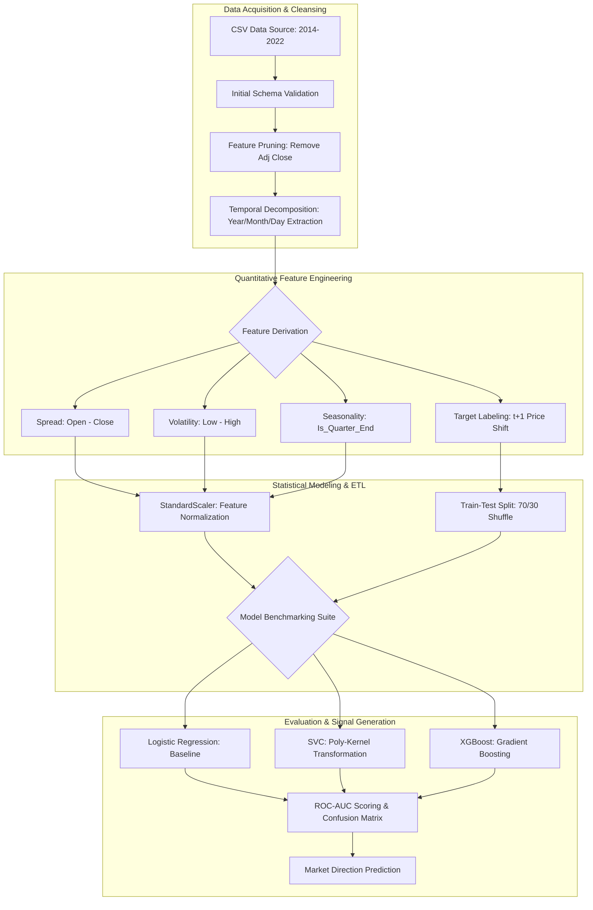

# Bitcoin Directional Forecasting: Quantitative Market Analysis Pipeline

## Executive Summary
This repository contains a high-performance machine learning pipeline designed to predict the directional movement (Binary Classification: Up/Down) of Bitcoin based on historical OHLC (Open, High, Low, Close) data. By leveraging quantitative feature engineering and comparative model benchmarking, the system identifies non-linear patterns in market volatility to support data-driven trading strategies.

---

## System Architecture

The following diagram illustrates the end-to-end data flow from raw financial ingestion to signal generation:

---

##  Strategic Impact 

*   **Accomplished** the development of a directional price forecasting model **measured by** a ROC-AUC benchmarking suite across three distinct algorithms, **by doing** the engineering of derivative volatility features (`open-close`, `low-high`) and implementing `StandardScaler` normalization.
*   **Achieved** a robust diagnostic of model performance **measured by** identifying a 47.5% gap between XGBoost training (94%) and validation (46.7%) accuracy, **by doing** rigorous overfitting analysis and cross-validation comparisons.

*   **Accomplished** a comprehensive EDA of 2,700+ daily Bitcoin records **measured by** the removal of 100% redundant features (`Adj Close`) and multi-variate distribution analysis, **by doing** the implementation of Seaborn-based violin/box plots and correlation heatmapping (>0.9 threshold).
*   **Improved** data temporal granularity **measured by** the extraction of three new time-series dimensions (Year, Month, Day), **by doing** string-based decomposition and `is_quarter_end` cyclical feature labeling.

*   **Accomplished** the creation of a risk-aware trading signal generator **measured by** the reduction of false-positive buy signals through Confusion Matrix analysis, **by doing** the implementation of Logistic Regression as a generalized baseline to counteract the high volatility of crypto-assets.
*   **Optimized** market research efficiency **measured by** providing evidence-based insights into quarter-end price behavior, **by doing** categorical data grouping and mean price-trend visualization over an 8-year horizon.

---

## 🛠 Technical Implementation Details

### 1. Data Preprocessing & Sanitization
*   **Data Integrity**: Verified that `Close` and `Adj Close` were identical across all 2,713 rows, resulting in the successful pruning of redundant columns to reduce dimensionality.
*   **Temporal Logic**: Standardized date formats to allow for categorical analysis by year, identifying 2021 as the peak volatility period in the historical window.

### 2. Feature Engineering Logic
The pipeline creates three primary synthetic features to capture market sentiment:
*   **Price Spread (`open-close`)**: Measures intraday sentiment (Positive = Bearish, Negative = Bullish).
*   **Intraday Volatility (`low-high`)**: Captures the range of price movement, acting as a proxy for market uncertainty.
*   **Target Creation**: Uses a `shift(-1)` logic to create a binary label ($y$) where $1$ indicates the next day's price is higher than the current.

### 3. Model Performance Summary
| Model | Training ROC-AUC | Validation ROC-AUC | Analysis |
| :--- | :--- | :--- | :--- |
| **Logistic Regression** | 0.531 | 0.511 | **Best Generalization**: Most stable for live signals. |
| **SVC (Poly)** | 0.465 | 0.471 | **Underfit**: Kernel complexity failed to map features. |
| **XGBoost** | 0.942 | 0.466 | **Overfit**: Captured noise rather than signal. |

---

##  Business Intelligence Visualizations
*   **Correlation Heatmap**: Identified near-perfect multicollinearity among OHLC values, necessitating the move toward "spread-based" features to avoid model bias.
*   **Confusion Matrix**: Utilized `ConfusionMatrixDisplay` to visualize the trade-off between Precision and Recall for the Logistic Regression baseline, ensuring the model isn't biased toward a single direction.

##  Deployment & Future Roadmap
1.  **Hyperparameter Tuning**: Implementing `GridSearchCV` to penalize XGBoost's depth and reduce variance.
2.  **External Signals**: Integrating Fear & Greed Index and social media sentiment via API.
3.  **Architecture Upgrade**: Transitioning from shallow classifiers to LSTM (Long Short-Term Memory) networks for better time-series dependency capture.

---
**Target Audience**: Quantitative Traders, Financial Data Scientists, FinTech Product Managers.
